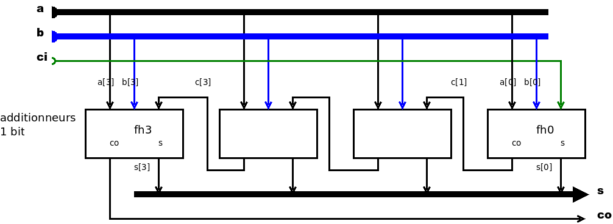

% Additionneur en Verilog, style structurel
% Michel Billaud (michel.billaud@laposte.net)
% 28 juin 2022

Ce texte fait partie d'une petite [collection de notes](index.html)
mise à disposition selon les termes de la [Licence Creative Commons
Attribution - Pas d’Utilisation Commerciale - Partage dans les Mêmes
Conditions 2.0
France](http://creativecommons.org/licenses/by-nc-sa/2.0/fr/).

- Les notes sont publiées dans  <https://www.mbillaud.fr/notes/>
- Sources dans <https://github.com/MichelBillaud/notes-diverses>

# Objectifs 

Dans cette note, on regarde comment 

- décrire un additionneur en Verilog en style "structurel" ;
- tester son fonctionnement en affichant tous les cas possibles.

Ceci en utilisant le compilateur `iverilog` que l'on trouve dans les
packages Debian.

Pour compléter, on construit un additionneur 2 x 4 bits, avec une
autre méthode de vérification. Avec 9 entrées (2 nombres de 4 bits et
une retenue entrante), 

- entrer les 512 cas à la main serait fastidieux (on va faire des boucles)
- afficher les 512 lignes ne permettrait pas de repérer les problèmes. 
on ne fera afficher que les lignes où il y a des anomalies.

# Demi-additionneur

Le circuit minimal pour faire une addition 

- prend en entrée deux nombres `a`, `b` de 1 bit chacun,
- fournit un nombre de deux bits : le chiffre de gauche `co` est la
  retenue sortante (output carry), le chiffre de droite `s` la somme.

Ce circuit est appelé **demi-additionneur**, on verra pourquoi plus loin.

## Fonction de transfert

La fonction de transfert indique la valeur des sorties en fonction de celle
des entrées. Sous forme de table :

| a  b | co s |
|------|------|
| 0 0  | 0 0  |
| 0 1  | 0 1  |
| 1 0  | 0 1  |
| 1 1  | 1 0  |

## Description structurelle du demi-additionneur

Ce circuit peut être construit par assemblage de **portes logiques**
de base. Ici la sortie `r` s'obtient par un "et" des deux entrées,
la sortie `s` par un ou-exclusif.

Cette description peut être codée en Verilog, en mettant le code suivant dans  un fichier source que nous nommerons `half-adder.vl` :

~~~verilog
// half-adder.vl
// description structurelle d'un demi-additionneur

module half_adder
  (
   output  co, s, 
   input   a, b
   );

   xor (s, a, b);
   and (co, a, b);
endmodule // half_adder
~~~

décrit un "module" qui 

- a 4 ports de branchement : 2 entrées `a` et `b`, et 2 sorties `co` et `s`.
- **contient** une porte `xor` et une porte `and` qui ont `a` et `b`
  en entrée, et dont les sorties sont reliées respectivement à `s` et
  `co `.
  
C'est une description **structurelle** : le circuit est décrit comme
une composition d'autres circuits. Verilog permet d'autres styles de
description.

**Notes**

- les portes `and`, `or` sont prédéfinies en Verilog ;
- il en existe d'autres (`not`, `xor`, `nand`, `nor`) ;
- le premier paramètre est la sortie.

C'est pour des raisons d'homogénéité que nous avons choisi, pour
`half_adder`, de mettre les sorties en premier.

## Tester le module

Pour tester le module `half_adder`, nous allons écrire une **simulation**,
qui 

- envoie successivement toutes les combinaisons de 0 et de 1 en entrée 
d'un circuit demi-additionneur ;
- affiche les valeurs des entrées et sorties du circuit 

~~~verilog
# test-half-adder.vl
# test d'un circuit half_adder

`include "half-adder.vl"

module test_half_adder;
   reg  a, b;
   wire co, s;
   half_adder h(co, s, a, b);

   initial begin
	  $monitor("%04t\t%b + %b = %b %b", 
			   $time, a, b, co, s);
	      a = 0; b = 0;
	  #10 a = 0; b = 1;
	  #10 a = 1; b = 0;
	  #10 a = 1; b = 1;
   end
endmodule // test_half_adder
~~~

Explications : ce module de test décrit 

- le matériel utilisé : un demi-additionneur (nommé `h`) connecté à deux
  entrées et deux sorties ;
- dans un bloc "`initial`", la séquence d'actions sur les entrées :
	- mettre a et b à 0;
	- attendre 10 unités de temps, puis mettre a à 0 et b à 1
	- attendre 10 unités de temps, puis mettre a à 1 et b à 0
	- etc.  tout en affichant les changements de valeurs quand ils se
	produisent (`$monitor`)
	
	
Les variable `a` et `b` ont des valeurs que nous pilotons
explicitement à notre gré au moment voulu de la simulation. Ce sont
des `registres` dans la terminologie Verilog.

Pour `co` et `s`, ce sont de simples fils (`wire`) dont l'état ne
dépend que des sorties auxquelles ils sont reliés.

Complément : l'instruction `$monitor` utilise une chaîne de format
similaire à celle de `printf` en C. Ici on trouve

- "`%04t`" pour afficher le temps (`$time`) sur 4 chiffres avec des 0 en tête ;
- "`\t`" pour une tabulation,
- "`%b`" pour chacun des bits `a`, `b`, `co` et `s`.

## Compilation et exécution

La suite de commandes

~~~
$ iverilog -o test-half-adder test-half-adder.vl
$ ./test-half-adder 
~~~

compile le fichier source et le fait exécuter, ce qui affiche

~~~
0000	0 + 0 = 0 0
0010	0 + 1 = 0 1
0020	1 + 0 = 0 1
0030	1 + 1 = 1 0
~~~

# Additionneur complet

Si on veut additionner des nombres de plus d'un bit, le
demi-additionneur ne suffit pas. En effet, il y a de retenues à
prendre en compte. 

Exemple d'addition en binaire `1010 + 1111 = 11001`
(en décimal 10 + 15 = 25). 

Si on procède selon la méthode habituelle qui va de droite à gauche,
à chaque étape (sauf tout à fait à droite), on doit additionner
**trois** bits : un pour chaque nombre, et la retenue entrante obtenue au
chiffre précédents.

## Fonction de transfert

Dans le tableau ci-dessous, on distingue les retenues entrante `ci` et
sortante `co`,

| a b ci | co s |   | a b ci | co s |
|--------|------|---|--------|------|
| 0 0 0  | 0 0  |   | 1 0 0  | 0 1  |
| 0 0 1  | 0 1  |   | 1 0 1  | 1 0  |
| 0 1 0  | 0  1 |   | 1 1 0  | 1 0  |
| 0 1 1  | 1  0 |   | 1 1 1  | 1 1  |

## Câblage du l'additionneur

Le schéma montre comment, avec deux demi-additionneurs et une porte
`ou`, on peut construire un additionneur complet.

## Description structurelle en Verilog

En suivant le schéma, nous construisant l'additionneur avec deux
instances nommées `h1` et `h2` du module demi-aditionneur, et une
porte `ou` :

~~~verilog
# full-adder.vl
# additionneur complet (3 bits en entrée, somme et retenue en sortie)

`include "half-adder.vl"

module full_adder
  (
   output  co, s,
   input   a, b, ci
   );
  
   wire    c1, c2, s1, s2;
   
   half_adder ha1(c1, s1, a, b);
   half_adder ha2(c2, s , s1, ci);
   or(co, c1, c2);
   
endmodule  // full_adder
~~~

## Simulation

La simulation est construite selon le même principe que précédemment

~~~verilog
# test-full-adder.vl
# test de l'additionneur

`include "full-adder.vl"

module test_full_adder;
   reg a, b, ci;
   wire co, s;

   full_adder adder(co, s, a, b, ci);

   initial begin
	  $monitor("%04t\t%b + %b + %b = %b%b", $time,  a, b, ci, co, s);
	  
	  #0      a = 0; b = 0; ci = 0;
	  #10	                ci = 1;
	  #10            b = 1; ci = 0;
	  #10	                ci = 1;
	  #10     a = 1; b = 0; ci = 0;
	  #10	                ci = 1;
	  #10            b = 1; ci = 0;
	  #10	                ci = 1;
   end
   
endmodule // test_full_adder
~~~

## Compilation et exécution

~~~
$ iverilog -o test-full-adder test-full-adder.vl
$ ./test-full-adder 
0000	0 + 0 + 0 = 00
0010	0 + 0 + 1 = 01
0020	0 + 1 + 0 = 01
0030	0 + 1 + 1 = 10
0040	1 + 0 + 0 = 01
0050	1 + 0 + 1 = 10
0060	1 + 1 + 0 = 10
0070	1 + 1 + 1 = 11
~~~

# Additionneur  4 bits

Un additionneur de  4 bits est constitué de 4 additionneurs 1 bit, en
connectant la retenue sortante de l'un à la retenue entrante de son
voisin.

Pour pouvoir chainer des additionneurs 4 bits, en plus des 2 nombres de 4 bits on
a aussi une retenue entrante et une retenue sortante.

## Description en Verilog

~~~verilog
`include "full-adder.vl"

module four_bit_adder
  (
   output 	           co, 
   output[NB_BITS-1:0] s, 
   input [NB_BITS-1:0] a,
   input [NB_BITS-1:0] b,
   input 		       ci
   );

   parameter NB_BITS = 4;

   wire [NB_BITS : 0] c;

   assign c[0] = ci;
   full_adder fh0(c[1], s[0], a[0], b[0], c[0]);
   full_adder fh1(c[2], s[1], a[1], b[1], c[1]);
   full_adder fh2(c[3], s[2], a[2], b[2], c[2]); 
   full_adder fh3(c[4], s[3], a[3], b[3], c[3]);
   assign co = c[4];
  
endmodule // four_bit_adder
~~~
   
Notes : 

1. Pour la lisibilité, on utilise une constante `NB_BITS` qui vaut 4.
2. Les entrées `a` et `b` et la sortie `s` sont des "bus", des faisceaux de fils
   indicés de 0 à `NB_BITS-1`.
3. Les retenues sont interconnectées par un bus interne `c`.
4. La déclaration `assign c[0] = ci;` indique que `c[0]` (retenue
entrante de `fh0`) prend sa valeur sur l'entrée `ci` du circuit.  De
même le `co` du circuit provient du `c[4]`, retenue sortante de `fh3`.
5. pour les autres, la retenue entrante de l'un provient de la retenue
   sortante de son voisin.

Il faut bien distinguer "`assign`" des affectations que nous avons utilisé dans les
simulations.

- dans le cas d'`assign`, que l'on appelle "continuous assignement", ça
correspond au câblage d'une entrée à quelque chose.
- dans le cas des simulations, c'est une valeur affectée à un registre
  à un moment donné.
  

Remarque : Les connexions des 4 instances de "full_adder" étant
similaires, on pourrait utiliser une technique avancée, consistant à
écrire une **boucle de génération**.

