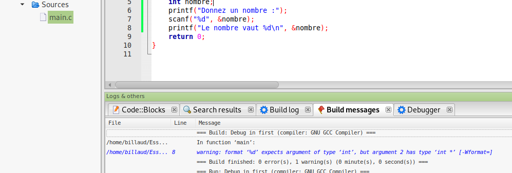

% Configurer CodeBlocks
% Michel Billaud (michel.billaud@laposte.net)
% 29 janvier 2022

Ce texte fait partie d'une petite [collection de notes](index.html)
mise à disposition selon les termes de la [Licence Creative Commons
Attribution - Pas d’Utilisation Commerciale - Partage dans les Mêmes
Conditions 2.0
France](http://creativecommons.org/licenses/by-nc-sa/2.0/fr/).

- Les notes sont publiées dans  <https://www.mbillaud.fr/notes/>
- Sources dans <https://github.com/MichelBillaud/notes-diverses>

# Objectifs 

Sur le Web, certains cours recommandent aux débutants en C/C++ d'utiliser
l'IDE (Integrated Development Environment = environnement de développement
intégré) CodeBlocks pour leurs premiers pas en C ou C++

Cette note n'est pas là pour critiquer ce choix, ni les cours en
question - malgré le mal que j'en pense - mais pour aider à le
configurer correctement pour débuter.

Ici on montre comment 

- demander au compilateur d'afficher les avertissements,
- configurer le compilateur pour la **bonne version** (récente) du langage,

# Affichage des avertissements.

## Un exemple
 
- Voici un programme C

~~~C
#include <stdio.h>

int main()
{
	int nombre;
	printf("Donnez un nombre :");
	scanf("%d", &nombre);
	printf("Le nombre vaut %d\n", &nombre);
}
~~~

qui a un petit souci (les redoublants, ne soufflez pas).

## Compilation et exécution

Quand on le compile, on ne voit pas de problème

~~~
gcc test1.c 
~~~

mais à l'exécution :

~~~
$ ./a.out 
Donnez un nombre :12
Le nombre vaut -1696745668
~~~

- Explication : mauvais paramètre de `printf` : on veut 
faire afficher la **valeur** contenue dans la variable `nombre`, 
pas son adresse. Il faut enlever le "&'.

# Une erreur détectable

Cette erreur était pourtant détectable par le compilateur.
En fait ce n'est pas tout à fait une erreur, parce que la norme
du langage C autorise ce qu'on a écrit, le problème étant que ça ne
fait pas ce qu'on souhaitait probablement.

Bref, le compilateur *peut* le signaler sous forme d'avertissement
(*Warning*) plutôt que de d'erreur. Mais il faut le lui demander, par
une option explicite `-Wall` pour avoir tous les avertissements
(*Warnings all*)

~~~
$ gcc -Wall test1.c 
test1.c: In function ‘main’:
test1.c:8:26: warning: format ‘%d’ expects argument of type ‘int’, but argument 2 has type ‘int *’ [-Wformat=]
    8 |  printf("Le nombre vaut %d\n", &nombre);
      |                         ~^     ~~~~~~~
      |                          |     |
      |                          int   int *
      |                         %ls
~~~

C'est la même option pour le compilateur `clang`, qui produit
généralement des messages plus clairs que `gcc`

~~~
$ clang -Wall test1.c 
test1.c:8:32: warning: format specifies type 'int' but the argument has type 'int *' [-Wformat]
        printf("Le nombre vaut %d\n", &nombre);
                               ~~     ^~~~~~~
1 warning generated.
~~~

D'autres options fournissent encore plus de messages d'avertissements,
non seulement à cause du code qui serait "limite" par rapport au
standard, mais aussi un peu louche du côté des pratiques de
programmation. 

Sur cet exemple ça ne produit rien de plus, mais je recommande
vivement de combiner les trois options  `-Wall -Wextra -pedantic`.

## Premier programme, voir les messages

Mon poste de travail est sous Linux avec la distribution Debian. La version
de CodeBlocks qui s'installe est la 20.03.

Lors de la première utilisation, il me demande de choisir le compilateur par
défaut, je choisi `gcc` (`gcc` et `clang` sont déja installés).

- je crée un projet : menu File, New..., Project, Console Application, C, Next, etc.
- je me retrouve avec un source pré-rempli

- J'y copie l'exemple ci-dessus, je clique sur Run. 
- L'IDE me propose de construire l'exécutable, j'accepte.
- Le programme est compilé, l'exécution se lance.

Ça ne va pas mieux marcher. Et on ne voit toujours pas de message d'erreur
ni d'avertissements

En fait pour les voir, il faut passer de l'onglet **Build Log** à
celui des **Build messages**, dans le panneau du bas "Logs and others" :

## Configurer les messages

On peut configurer les options concernant les messages d'erreur, à deux niveaux

- soit pour le projet en cours (menu `Project` / `Build options`
- ou globalement, en passant par la barre de menu, dans `Settings` /
`Compiler` / `Global Compiler Settings`.

Faites défiler, vous trouverez les options qui vous intéressent :

# Préciser le standard du langage

Pour écrire du code, on choisit un langage de programmation, et
plus précisément de se conformer à un **standard** pour ce langage. 

Par exemple, si on programme en C, on peut choisir les standards C99, C11,
C17, ou des versions du langage avec extensions. Pour C++ : 98, 11, 14, 17 et 20.

En général, il est préférable de choisir le standard le plus récent
(l'histoire va dans ce sens), mais on peut aussi être contraint de se
fixer sur un standard plus ancien, pour rester compatible avec
d'autres développeurs qui ne disposent pas d'outils plus à jour. Ou
parce qu'une fonctionnalité obsolète, dont on a absolument besoin, a
été retirée du standard.

Le choix du standard se fait dans la même boite :

**Exercice** : créez un projet C++, avec le source suivant

~~~C++
#include <iostream>

int main()
{
    for (auto i = 1; i <= 5; i++) {
        std::cout << "Hello !"<< std::endl;
    }
    return 0;
}
~~~

En jouant avec les options, déterminez à partir de quel niveau de standard
le mot-clé `auto` est reconnu pour déclarer des variables.

