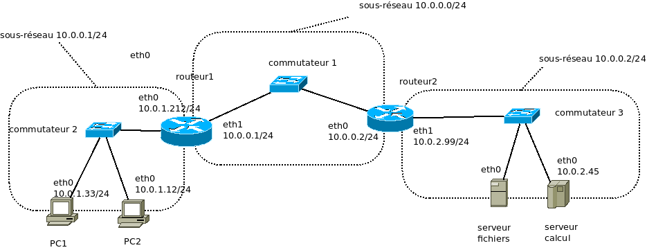

% Routage entre réseaux locaux
% Michel Billaud (michel.billaud@u-bordeaux.fr,  michel.billaud@laposte.net)
% 2 juin 2020

Ce texte fait partie d'une petite [collection de notes](index.html)
mise à disposition selon les termes de la [Licence Creative Commons
Attribution - Pas d’Utilisation Commerciale - Partage dans les Mêmes
Conditions 2.0
France](http://creativecommons.org/licenses/by-nc-sa/2.0/fr/).

# Interconnexion de réseaux

Le monde (du moins Internet) est composé de réseaux locaux,
inter-connectés par des machines, appelées **passerelles** ou
**routeurs**, qui sont à cheval sur plusieurs réseaux locaux.

**Par exemple** votre casque Bluetooth est sur le même réseau local
(Bluetooth) que votre Smartphone, qui est relié au réseau Wifi de
votre domicile. Une "box" fait le lien (par fibre, câble, ou ligne
téléphonique) avec un équipement réseau situé dans un local technique,
accède au réseau de votre fournisseur d'accès, inter-connecté sur un
"point d'échange" (Internet Exchange Point = IXP) avec celui des
autres fournisseurs.

Votre smartphone est donc une passerelle entre un réseau local Bluetooth et
le réseau local Wifi, etc.

Remarquez que des technologies très diverses sont employées,
avec des trames qui peuvent être de nature très différentes.

# Transmission de paquets

Quand chez vous ordinateur portable, connecté en wifi, veut consulter
un site web quelque part, 

- il émet sa requête HTTP dans un **paquet contenu dans une trame Wifi** à
  la norme IEEE 802.11.
- cette trame 802.11 est reçue par votre "Box", qui en extrait le paquet à
transmettre, et le réexpédie en l'emballant **dans une trame ADSL**
vers le DSLAM (équipement du fournisseur). Ou des trames GPON si vous
êtes raccordé par fibre optique.
- etc.

Ce qui transite d'un bout à l'autre d'Internet, entre votre ordinateur
et le serveur Web que vous consultez, ce sont donc des **paquets**.
Les trames, c'est un moyen d'**emballer** des paquets
pour les faire transiter sur un réseau local d'un type particulier.

# Adresses et sous-réseaux

Pour acheminer les paquets, ils doivent contenir des adresses d'expéditeur
et de destinataire.

L'adresse d'expéditeur est utile, elle permet d'une part au destinataire
d'identifier l'émetteur, d'autre part de prévenir l'émetteur
quand le destinataire est inaccessible.

## Adresses Ipv4 et IPv6

Pour le réseau Internet, on utilise deux types d'adresses :

- les adresses IPv4, qui sont sur 32 bits (4 octets), et que vous
  voyez généralement sous la forme "décimale pointée", comme
  192.168.1.32  (chaque nombre décimal, entre 0 et 255, code un octet).
  
- les adresses IPv6, sur 128 bits (16 octets), exprimées sous forme de
8 nombres hexadécimaux (chaque nombre, entre `0000` et `ffff`,
représente 16 bits, soit 2 octets). Exemple
`2001:067c:02e8:0022:0000:0000:c100:068b` que l'on abrège en
`2001:67c:2e8:22::c100:68b` (le "`::`" indique un "trou" où l'on place
autant de nombres zéro que nécessaire).

Ce sont des **adresses logiques** qui servent à désigner quelque chose
sur Internet.  Il ne faut pas les confondre avec les **adresses
physiques** (adresses MAC) qui servent à envoyer les trames sur un
réseau local.

## Sous-réseau

Les explications qui suivent seront illustrées par des adresses IPv4.

Un sous-réseau est formé d'**adresses voisines**, qui ont un
**préfixe** (début d'adresse) commun.  La longueur du préfixe est
exprimée en nombre de bits.

**Exemple 1**  : le sous-réseau `192.168.12.0/24` :

- le préfixe commun contient 24 bits, soit 3 octets (3 x 8 = 24),
- les adresses commencent donc par `192.168.12`,
- le reste de l'adresse peut varier : il s'agit donc des adresses de
la forme `192.168.12.x` avec x de 0 à 255.

**Exemple 2** : le sous-réseau `10.0.0.0/16`

- le préfixe contient 16 bits ; les adresses commencent par `10.0`.
- les adresses du sous-réseau vont donc de `10.0.0.0` à `10.0.255.255`.

La longueur du préfixe donne une décomposition d'une adresse IPv4 en 2
parties :

- le **numéro de sous-réseau**, au début (le préfixe),
- le **numéro d'hôte** à la fin.

Voir l'annexe pour plus de détails sur les calculs d'adresse.

**Dans la littérature ancienne**, vous trouverez la notion de **masque de
sous-réseau**, qui est une manière obsolète et malcommode de noter une
longueur de préfixe.

Un masque binaire est composé de 32 bits, qui sont tous à 1 à gauche
et tous à 0 à droite. Le nombre de bits à 1 correspond à la taille du
préfixe.  On les écrit en notation décimale pointé.  Le masque
`255.255.255.0`, en binaire `11111111 11111111 11111111
00000000`, correspond à "/24".
Inversement, le masque pour "/28" est `255.255.240.0`.

## Réseau local et réseaux logiques

Sur un réseau local, on connecte des machines qui ont des adresses IP
correspondant à un sous-réseau logique (ou un petit nombre de réseaux
logiques).

# Émission et retransmission 

Quand on installe une machine sur un réseau local, on lui attribue un
numéro IP. Plus exactement, le numéro IP est attribué à la carte réseau
qui la connecte au réseau local.
On précise aussi le sous-réseau logique dont elle fait partie, en
indiquant la taille du préfixe (ou le masque de sous-réseau).

## Configuration 

Par exemple, si on lance la commande de configuration

~~~
ifconfig eth0 147.210.94.195/28 
// ou
ip addr add 147.210.94.195/28 dev eth0
~~~

- l'adresse IP associée à la carte réseau `eth0` est 147.210.94.195
- le sous-réseau a un préfixe de longueur 28,
- c'est-à-dire que les adresses `147.210.94.192` à `207` sont considérées
	comme étant directement accessibles sur le réseau local.

## Communication sur le même sous-réseau

Par conséquent, si on doit envoyer un paquet à une adresse comme
`147.210.94.203`, qui fait partie de ce même sous-réseau :

- le paquet contiendra comme 
	- adresse IP source `147.210.94.195`, 
	- adresse IP  destination `147.210.94.203` ;
- le paquet sera mis dans une trame avec
	- comme adresse MAC source celle de la carte  `eth0`
	- comme adresse MAC de destination, celle qui correspond à
      `147.210.94.197`,
- et la trame sera expédiée par `eth0`.

(L'adresse MAC de `147.210.94.197` aura éventuellement été obtenue par 
une protocole de résolution d'adresse comme `ARP`).

## Communication avec l'extérieur

Si maintenant la machine `147.210.94.197` veut envoyer des paquets à
l'adresse IP `45.60.155.214` (`www.elysee.fr`), elle doit les
transmettre à une machine **passerelle** (gateway) chargée de la
communication avec l'extérieur. On parle de routeur.

Pour cela, on a défini une **route** par défaut, par une commande de
configuration comme

~~~
route add net default gw 147.210.94.206
// ou 
# ip route add default via 192.168.1.254
~~~

Le mot-clé `default` représente `0.0.0.0/0`, le réseau qui contient
toutes les adresses.

Cette configuration indique que les paquets destinés à d'autres
adresses que le réseau local doivent être envoyés au routeur,
qui les fera suivre.

Donc pour expédier un paquet

- avec adresse IP source `147.210.94.197` (l'envoyeur).
- avec adresse IP destination `45.60.155.214` (destination finale)

on le met dans une trame qui a

- l'adresse MAC source de la carte réseau émettrice
- l'adresse MAC destination de la **carte réseau de la passerelle**
  `147.210.94.254` (destination sur le réseau local).

## Transmission par le routeur

Le routeur accepte donc la trame (l'adresse MAC de destination est
la sienne), et constate que le paquet ne lui est pas destiné
(l'adresse IP de destination n'est pas la sienne). Il faut donc le
retransmettre.

Pour cela, le routeur détermine ce qu'il va en faire, à partir

- de la configuration de ses cartes réseau
- des routes qui ont été ajoutées.

Si la destination est directement sur un réseau local connecté à la
passerelle, le routeur va envoyer une trame à la destination.
Si, il va transmettre à un autre routeur.

# Étude de cas

L'exemple 1 montre un réseau d'entreprise, non connecté à l'extérieur,
comportant 3 réseaux locaux

- à gauche un réseau de PCs, derrière un routeur
- à droite un réseau avec des serveurs, derrière un second routeur.
- au milieu, un réseau servant à interconnecter les routeurs.

## Configuration de PC1

L'ordinateur PC1

- s'est vu attribuer l'addresse 10.0.1.33/12 sur sa carte réseau `eth0`,
- il peut donc communiquer directement avec PC1 et Routeur1, qui sont
reliés au même réseau physique avec des adresses IP du même réseau
logique.
- Pour communiquer avec les autres machines, il faut passer par le routeur 1.

Donc on peut le configurer

ainsi

~~~
ip addr  add 10.0.1.33/24 dev eth0
ip route add default      via 10.0.1.212
~~~

## Configuration du routeur 1

Ce routeur est connecté à deux réseaux locaux : le PC et le réseau
d'interconnexion des routeurs.

Configuration des interfaces : 

~~~
ip addr  add 10.0.1.212/24 dev eth0
ip addr  add 10.0.0.1/24   dev eth1
~~~

Il faut ajouter une route pour indiquer que les paquets destinés
au réseau des serveurs doivent passer par le routeur2

~~~
ip route add 10.0.2.0/24   via 10.0.0.2
~~~

La configuration des autres machines est similaire.

## Routage avec l'extérieur

On veut maintenant communiquer avec d'autres réseaux.  On met en place
un nouveau routeur, raccordé par exemple au commutateur 1, avec
l'adresse `10.0.0.254`.

Sur les deux routeurs, on ajoute des routes de sortie :

~~~
ip route add default  via 10.0.0.254
~~~

# Table de routage, stratégie

Pour retransmettre un paquet vers une destination dont elle connait
l'adresse IP, une machine 

- consulte les configurations des interfaces et les routes,
- retient la route **la plus spécifique**.

**Exemple** : le routeur 1 doit envoyer un paquet à 10.0.2.45

Dans sa **table de routage**, il a les informations suivantes :

~~~
sous-réseau   direct     par passerelle
-----------   ---------  --------------
10.0.1.0/24   eth0
10.0.0.0/24   eth1
10.0.2.0/24              10.0.0.2
0.0.0.0/0                10.0.0.254
~~~

Seules les deux dernières correspondent à `10.0.2.45`.  On va retenir
la troisième parce que c'est la plus spécifique (préfixe le plus
long).  Elle indique qu'il faut passer par `10.0.0.2`.

En regardant à nouveau les interfaces, cette passerelle est joignable
sur le réseau local relié à `eth1`.

Le paquet sera donc mis dans une trame transmise à la passerelle par
la carte réseau `eth1` :

- adresse MAC d'origine : celle de la carte `eth1` du routeur1,
- adresse MAC de destination : celle qui est associée à `10.0.0.2`.

 

# Annexes

## Calculs d'adresse

### Un exemple détaillé 

Le calcul est un peu plus sportif quand la longueur de préfixe n'est
sont pas multiple de 8, parce que le partage en adresse de
sous-réseau/adresse d'hôte se fait à l'intérieur d'un octet.

En pratique, pour vous aider, écrivez les 9 octets qui ont des 1 à
gauche et des 0 à droite

~~~
 binaire  décimal        binaire  décimal       binaire  décimal
00000000     0           11100000               11111100
10000000   128           11110000               11111110    254
11000000                 11111000               11111111    255
~~~

**Exemple** : quelles adresses sont dans le sous-réseau `10.11.12.0/22`  ?

**Raisonnement**

1. Si on convertit `10.11.12.0` en binaire, on obtient

~~~
décimal       10.      11.      12.       0
binaire 00001010 00001011 00111100 00000000
~~~

2. Le préfixe est formé des 22 premiers bits :

~~~
        <----- 22 bits ------>
préfixe 00001010 00001011 0011____ ________
~~~

3. En faisant varier la partie "numéro d'hôte", les adresses vont donc 

~~~ 
        <--- num ss réseau --><- num hôte >
de      00001010 00001011 00110000 00000000
à       00001010 00001011 00111111 11111111
~~~

**Réponse** : en convertissant en décimal, ce sont 
les adresses de `10.11.12.0` à `10.11.15.255`.

**Remarque** : comme la longueur du préfixe est entre 16 et 24,
le "partage" se fait dans le troisième octet. On aurait
pu se dispenser de convertir les 3 autres.

### Exercices

- Quelles sont les adresses contenues dans `147.210.94.192/28` ?
- Quel est le rapport entre la taille du préfixe, et le nombre
d'adresses d'un sous-réseau ?
- Quel est le **plus petit sous-réseau** qui contienne à la fois
  `10.53.122.12` et `10.53.97.32` ?
- Montrez que si deux sous-réseaux ont au moins une adresse commune,
l'un des deux est inclus dans l'autre.

## Métrique pour le routage

La stratégie  de routage peut aussi utiliser une notion 
de distance ("métrique") associée aux routes.

Possibilités :

- si il y a plusieurs routes pour joindre une destination, 
avec le même degré de spécificité (longueur du préfixe),
prendre la plus courte.
- si pluseurs routes ont la même métrique, faire passer les paquets
alternativement par ces routes, pour répartir la charge.

## Incidents de routage

Quelques problèmes éventuels lors de l'acheminement des paquets.

1. Une machine ne trouve pas, dans sa table de routage, de route permettant
d'expédier un paquet IP vers une destination.

Elle retourne donc à l'expéditeur un message de contrôle "Net unreachable".

2. Une machine doit transmettre une trame à une autre machine du réseau local 
(destinataire final ou passerelle), mais on n'arrive
pas à obtenir son adresse MAC, ce qui est mauvais signe.

On retourne alors un message de contrôle "Host unreachable".

3. Les messages IP tournent en rond sur le réseau.

... suite à des erreurs de configuration, ou de câblage.
C'est détecté par la présence, dans un paquet IP, d'un compteur nommé
TTL (time to live) qui est incrémenté à chaque traversée d'un
routeur. 

Les routeurs ignorent en silence les paquets dont le TTL
excède une certaine limite (quelques dizaines).

